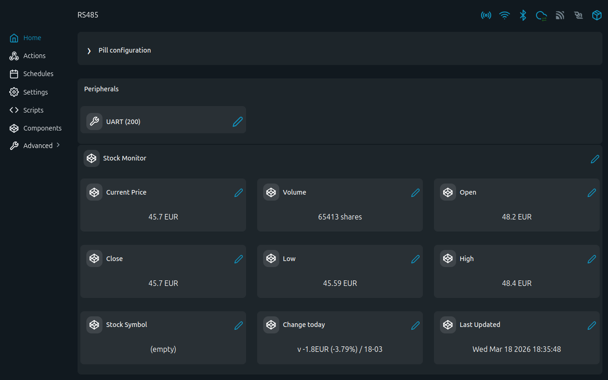

# Yahoo Finance Stock Monitor

Track a stock symbol from Yahoo Finance and publish key market fields to Shelly Virtual Components.

## Problem (The Story)
You want a quick market snapshot on your Shelly dashboard, but most finance widgets are tied to external apps or cloud dashboards. This script fetches the latest daily quote data from Yahoo Finance and writes price, open/close, high/low, volume, and daily change directly into Virtual Components for local display and automation.

## Persona
- Home automation user who wants market context on a Shelly dashboard
- DIY investor monitoring one or a few symbols without opening a broker app
- Maker building simple finance-aware automations from HTTP data

## Files
- [`stock-monitor_vc.shelly.js`](stock-monitor_vc.shelly.js): Yahoo Finance poller + Virtual Component updater

## Screenshot
This screenshot shows the Stock Monitor Virtual Components group in the Shelly UI with current price, open/close, high/low, volume, daily change, and last update timestamp.

## What It Updates
- `number:200` current price
- `number:201` volume
- `number:202` open
- `number:203` close
- `number:204` low
- `number:205` high
- `text:200` symbol
- `text:201` daily change
- `text:202` last update timestamp

## How It Works
1. Calls Yahoo Finance chart API for `STOCK_SYMBOL`
2. Parses the latest day metadata and quote fields
3. Writes values to Virtual Components
4. Repeats every 5 minutes

## Notes
- The default symbol in the script is `SLYG.DE`; edit `STOCK_SYMBOL` to your preferred ticker.
