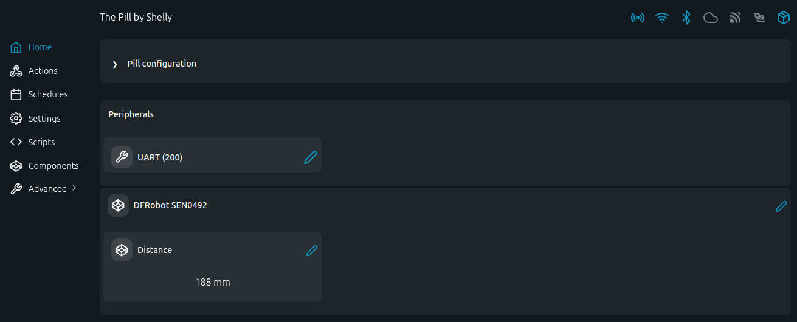

# DFRobot SEN0492 Laser Ranging Sensor - MODBUS-RTU Examples

Read laser distance measurements from a DFRobot SEN0492 RS485 laser ranging sensor using The Pill.

## Problem (The Story)
Industrial distance sensing often requires a rugged, IP67-rated laser sensor with a standard RS485 interface. These scripts poll the SEN0492 over MODBUS-RTU locally and make the distance reading available in the console or Shelly Virtual Components — no proprietary gateway needed.

## Persona
- Automation engineer integrating distance measurement into a local control loop
- Installer monitoring fill levels, object presence, or conveyor positions
- DIY user replacing cloud-dependent sensors with local RS485 telemetry

## Screenshot

This screenshot shows the DFRobot SEN0492 Virtual Components page with the Distance reading (188 mm) grouped under the "DFRobot SEN0492" group in the Shelly UI.

## Device

| Parameter | Value |
|---|---|
| Manufacturer | DFRobot |
| Model | SEN0492 |
| Type | Laser Ranging Sensor (RS485) |
| Measurement range | 40–4000 mm (4 cm – 4 m) |
| Accuracy | ±2 cm |
| Interface | RS485 (industrial 485 chip), Modbus RTU |
| Power supply | 5–36 V DC |
| Current | < 38 mA |
| Update rate | 20 Hz (default) |
| Protection | IP67 |
| Operating temp | −20 to +70 °C |

## Files

- [`sen0492.shelly.js`](sen0492.shelly.js): console reader — prints distance and status
- [`sen0492_vc.shelly.js`](sen0492_vc.shelly.js): console reader + Virtual Component update

## Register Map

### Read (FC 0x03 - Read Holding Registers)

| Address | Dec | Parameter | Type | Unit | Notes |
|---|---|---|---|---|---|
| `0x34` | 52 | Distance | UINT16 | mm | Range: 0–4000 |
| `0x35` | 53 | Output State | UINT16 | — | See status codes below |
| `0x37` | 55 | Calibration Mode | UINT16 | — | Read status; write `0x04` to enter |

### Write (FC 0x03 / FC 0x06 - Read/Write Holding Registers)

| Address | Dec | Parameter | Type | Unit | Range |
|---|---|---|---|---|---|
| `0x00` | 0 | System Recovery | UINT16 | — | Write `0x01` for factory reset |
| `0x02` | 2 | Alarm Threshold | UINT16 | mm | 40–4000 |
| `0x04` | 4 | Baud Rate Index | UINT16 | — | 0=2400, 1=4800, 2=9600, 3=19200, 4=38400, 5=57600, 6=115200, 7=230400, 8=460800, 9=921600 |
| `0x07` | 7 | Timing Preset | UINT16 | ms | 20–1000 |
| `0x08` | 8 | Measurement Interval | UINT16 | ms | 1–1000 |
| `0x1A` | 26 | Slave Address | UINT16 | — | 0x00–0xFE |
| `0x36` | 54 | Measurement Mode | UINT16 | — | `1`=≤1.3 m, `2`=≤3 m, `3`=≤4 m |

### Status Codes (register `0x35`)

| Code | Meaning |
|---|---|
| `0x00` | Valid measurement |
| `0x01` | Sigma Fail |
| `0x02` | Signal Fail |
| `0x03` | Min Range Fail |
| `0x04` | Phase Fail |
| `0x05` | Hardware Fail |
| `0x07` | No Update |

### Example Frames

| Direction | Frame | Notes |
|---|---|---|
| TX | `50 03 00 34 00 01 C8 45` | Read distance register |
| RX | `50 03 02 07 0B 06 7F` | Response: 0x070B = 1803 mm |

## RS485 Default Parameters

| Parameter | Value |
|---|---|
| Baud rate | 115200 |
| Frame format | 8N1 |
| Slave ID | `0x50` (80) |
| Protocol | Modbus RTU |

## Virtual Component Mapping

| Component | Name | Unit |
|---|---|---|
| `number:200` | Distance | mm |
| `group:200` | DFRobot SEN0492 | — |

> The VC is only updated when status is `0x00` (Valid). Erroneous readings are not pushed.

## RS485 Wiring (The Pill 5-Terminal Add-on)

| The Pill Pin | Wire Color | Sensor Signal |
|---|---|---|
| `IO1 (TX)` → `B` | Green | RS485 B |
| `IO2 (RX)` → `A` | Yellow | RS485 A |
| `IO3` → `DE/RE` | — | transceiver direction (automatic) |
| `GND` | Black | GND |
| `5–36 V` (separate supply) | Red | VCC |
| not connected | White | ALARM (open-collector, active LOW) |

## Reference

- [DFRobot SEN0492 Wiki](https://wiki.dfrobot.com/Laser_Ranging_Sensor_RS485_4m_SKU_SEN0492)
- [DFRobot SEN0492 Product Page](https://www.dfrobot.com/product-2372.html)
