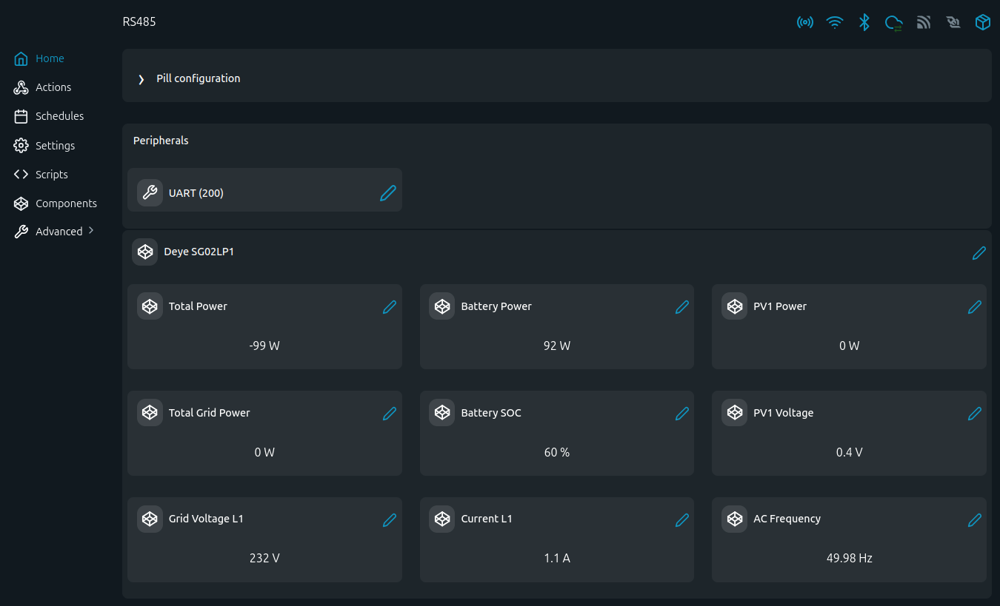

# Deye SG02LP1 MODBUS Examples

Read-only Deye inverter telemetry over RS485 MODBUS-RTU using The Pill.

## Problem (The Story)
Energy dashboards and automations need live PV, battery, and grid values. Many installs expose this only through vendor tools. These scripts poll key Deye registers locally and make data available in logs or Virtual Components.

## Persona
- Home energy enthusiast tracking PV/battery/grid flows
- Installer integrating inverter values into local automations
- Engineer validating inverter behavior without cloud dependency

## Files
- [`deye.shelly.js`](deye.shelly.js): console telemetry reader
- [`deye_vc.shelly.js`](deye_vc.shelly.js): telemetry + Virtual Components

## Screenshot

This screenshot shows the Deye Virtual Components dashboard for PV, battery, grid, voltage, current, frequency, and SOC monitoring.

## RS485 Wiring (The Pill 5-Terminal Add-on)

```
                        |=============|              |==============|
                   /====|         VCC |              |              |
                   |    | GND     GND |              | SLAVE DEVICE |
/========\         |    | TX      +5V |              |              |
|The Pill|-----=||||    | RX        A |------\/------| A            |
\========/         |    | RE/DE     B |------/\------| B            |
                   |    | +5V       A |              |              |
                   \====|           B |              |              |
                        |=============|              |==============|
```

Default communication in examples: `9600`, `8N1`.
