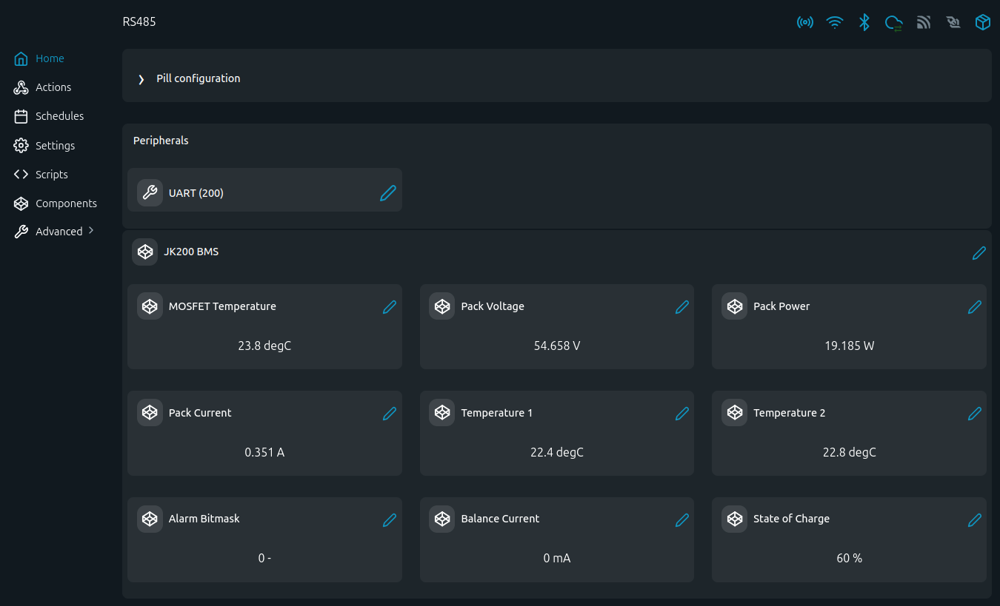

# JK200 BMS MODBUS Examples

MODBUS-RTU scripts for JK-PB series BMS (commonly called JK200 variants).

## Problem (The Story)
You need reliable pack voltage/current/SOC/cell telemetry and alarm visibility from JK BMS on a local bus. These scripts read JK MODBUS registers and expose battery health in a format suitable for local automation.

## Persona
- DIY battery builder running JK BMS
- Energy integrator connecting BMS data to Shelly automations
- Service technician diagnosing cell imbalance and protection trips

## Files
- [`jk200.shelly.js`](jk200.shelly.js): console reader
- [`jk200_vc.shelly.js`](jk200_vc.shelly.js): reader + Virtual Components

## Screenshot

This view shows the JK200 Virtual Components page with pack-level telemetry, temperatures, alarm bitmask, balance current, and SOC values.

## RS485 Wiring (The Pill 5-Terminal Add-on)
| The Pill Pin | JK BMS Side |
|---|---|
| `IO1 (TX)` -> `B (D-)` | RS485 B |
| `IO2 (RX)` -> `A (D+)` | RS485 A |
| `IO3` -> `DE/RE` | transceiver direction |
| `GND` -> `GND` | common reference |

Default communication in JK examples: `115200`, `8N1`.
