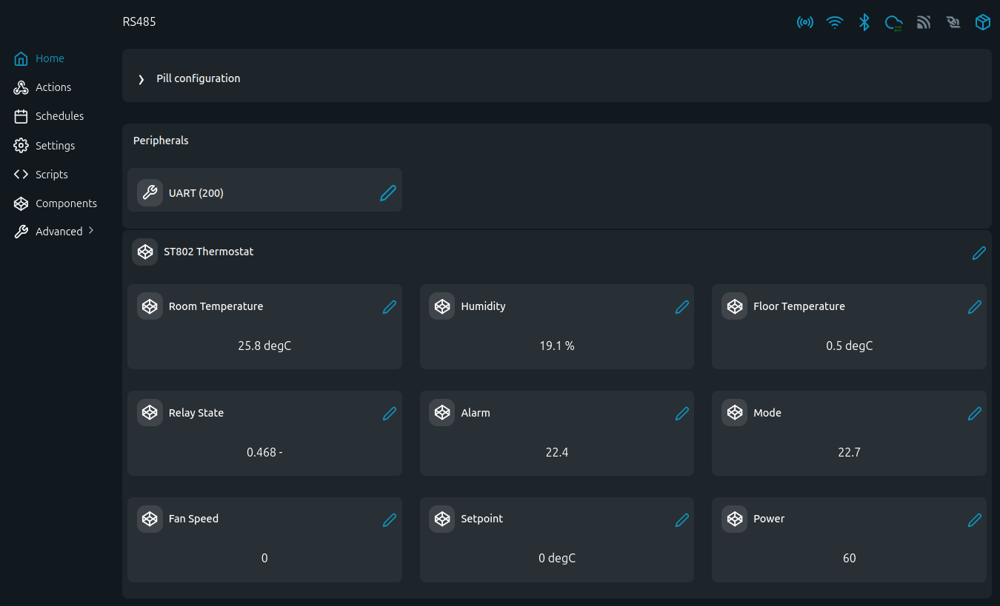

# LinkedGo ST802 MODBUS Examples

ST802 thermostat scripts acting as a MODBUS BMS-side client from The Pill.

## Problem (The Story)
A central automation controller needs to enforce operating mode, setpoint, and fan behavior on ST802 thermostats without manual interaction. These scripts simulate BMS commands and read back key status values.

## Persona
- HVAC controls integrator for fan-coil/floor systems
- Installer standardizing room-control behavior across zones
- Commissioning engineer validating mode and relay operation

## Files
- [`st802_bms.shelly.js`](st802_bms.shelly.js): command + polling script
- [`st802_bms_vc.shelly.js`](st802_bms_vc.shelly.js): same with Virtual Components

## Screenshot

This screen shows the ST802 Virtual Components with room/floor temperature, humidity, relay/alarm status, mode, fan speed, setpoint, and power state.

## RS485 Wiring (The Pill 5-Terminal Add-on)
| The Pill Pin | ST802 Side |
|---|---|
| `IO1 (TX)` -> `B2 (D-)` | RS485-2 B |
| `IO2 (RX)` -> `A2 (D+)` | RS485-2 A |
| `IO3` -> `DE/RE` | transceiver direction |
| `GND` -> `GND` | common reference |

Common defaults: `9600`, `8N1`, slave `1`.
