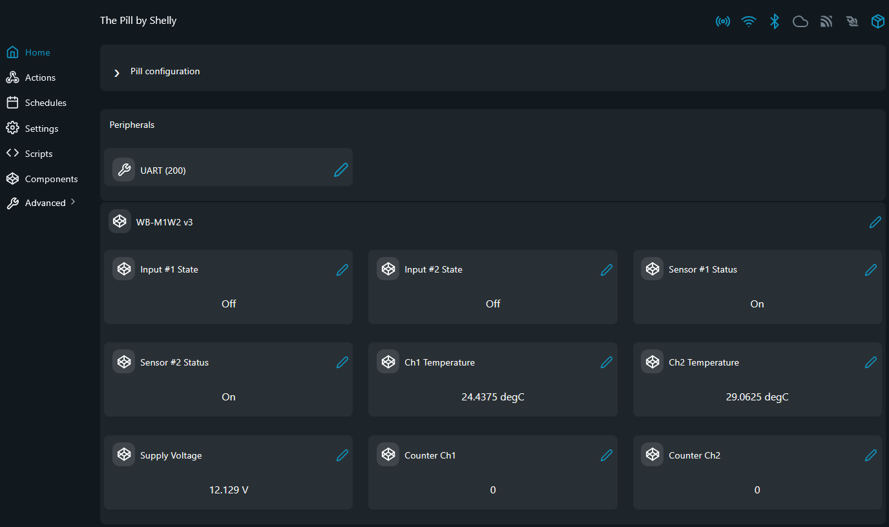

# Wirenboard MODBUS Examples

Wirenboard area for industrial sensor MODBUS examples on The Pill.

## Problem (The Story)
Wirenboard devices expose environmental, input, and IR data over RS485 MODBUS-RTU, but connecting them to Shelly automations requires a bridge. This folder groups scripts that convert those registers into local telemetry visible through the Shelly UI.

## Persona
- Building automation integrator using Wirenboard sensors alongside Shelly
- Smart home installer adding temperature and button input monitoring
- DIY user wiring an IR transceiver into a local control loop

## Available Device Folders
- [`WB-M1W2-v3/`](WB-M1W2-v3/): Wirenboard WB-M1W2 v3 1-Wire to RS-485 converter — dual DS18B20 channel reader + slave scanner
- [`WB-MIR-v-3/`](WB-MIR-v-3/): Wirenboard WB-MIR v3 IR transceiver + DS18B20 temperature + button input examples

## Screenshots
### WB-M1W2 v3
This screenshot shows the WB-M1W2 v3 telemetry page with temperatures, supply voltage, counters, and discrete input states in the Shelly UI.

### WB-MIR v3
This screenshot shows the WB-MIR v3 telemetry page with temperature, supply voltage, MCU temperature, and module status indicators in the Shelly UI.

## RS485 Wiring (The Pill 5-Terminal Add-on)
Use The Pill mapping from the MODBUS root README:
- `IO1 (TX)` -> `B (D-)`
- `IO2 (RX)` -> `A (D+)`
- `IO3` -> `DE/RE`
- `GND` shared
