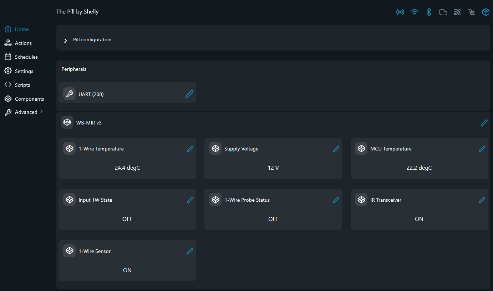

# WB-MIR v3 MODBUS Examples

MODBUS-RTU scripts for the Wirenboard WB-MIR v3 IR transceiver and environment sensor module.

## Problem (The Story)
You have a WB-MIR v3 on the RS485 bus and want to read DS18B20 temperature, monitor IR and 1-Wire module presence, and track supply voltages — all from a Shelly device without a separate gateway.

## Persona
- Building automation integrator reading temperature and input events over MODBUS
- Smart home installer bridging IR control into Shelly automations
- DIY user monitoring power supply health on a Wirenboard device

## Files
- [`wb_mir_v3.shelly.js`](wb_mir_v3.shelly.js): console reader (logs to print output)
- [`wb_mir_v3_vc.shelly.js`](wb_mir_v3_vc.shelly.js): reader + Virtual Components
- [`wb_mir_v3_reconfig.shelly.js`](wb_mir_v3_reconfig.shelly.js): one-shot utility to change baud rate and slave ID over MODBUS (run once, then disable)
- [`wb_mir_v3_ir.shelly.js`](wb_mir_v3_ir.shelly.js): dedicated IR utility for learning, playback, ROM dump, and erase operations — *under development*

## Screenshot
This screenshot shows the WB-MIR v3 telemetry page with 1-Wire temperature, supply voltage, MCU temperature, and IR / 1-Wire module status in the Shelly UI.



## IR Utility (`wb_mir_v3_ir.shelly.js`)
Dedicated IR operations for the WB-MIR v3:
- learn one remote command into ROM
- learn one remote command into RAM and dump the raw buffer
- play a stored ROM command
- play the current RAM buffer
- dump an existing ROM slot into raw timings
- erase all ROM-stored IR commands

Important IR registers used by the script:
- `5000`: erase all ROM commands
- `5001`: learn into RAM
- `5002`: play from RAM
- `5500`: play from ROM slot
- `5501`: open ROM slot for editing / dump via holding registers `2000+`
- `5502`: learn into ROM slot

The raw IR waveform buffer is exposed in holding registers starting at `2000`.
Each value is a pulse duration in 10 us units, and the sequence ends with two
consecutive zero words.

## Virtual Component Mapping (`wb_mir_v3_vc.shelly.js`)
| Virtual Component | Name | Unit |
|---|---|---|
| `number:200` | 1-Wire Temperature | degC |
| `number:201` | Supply Voltage | V |
| `number:202` | MCU Temperature | degC |
| `boolean:200` | Input 1W State | 0=open, 1=closed |
| `boolean:201` | 1-Wire Probe Status | 0=disconnected, 1=connected |
| `boolean:202` | IR Transceiver | 0=absent, 1=present |
| `boolean:203` | 1-Wire Sensor | 0=absent, 1=present |
| `group:200` | WB-MIR v3 | group |

## RS485 Wiring (The Pill 5-Terminal Add-on)

```
                        |=============|              |==============|
                   /====|         VCC |              |              |
                   |    | GND     GND |              | SLAVE DEVICE |
/========\         |    | TX      +5V |              |              |
|The Pill|-----=||||    | RX        A |------\/------| A            |
\========/         |    | RE/DE     B |------/\------| B            |
                   |    | +5V       A |              |              |
                   \====|           B |              |              |
                        |=============|              |==============|
```

Default communication settings: `9600 baud`, `8N2`, Slave ID `1`.

## References
- [WB-MIR v3 Register Map](https://wiki.wirenboard.com/wiki/WB-MIR_v3_Registers)
