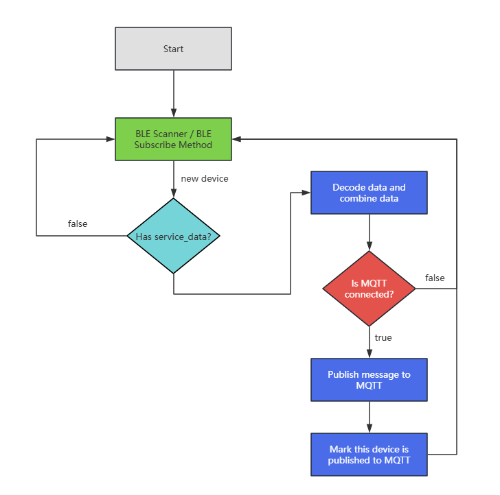

# Universal BLU to MQTT Script

## Short description

- This script is about shares any BLU product's complete payload to MQTT.

- The script should not require an individual BLU device's MAC address, rather it will "listen" for any BLU device.

- It would use the MAC address to create the topic, with a key-value for each data point in the payload.

## Running Process

### Here is the summary of how it works:

- Scanning: The script will open a BLU passive scan to receive any BLU device data. Using the BLE.Scanner.Start and BLE.Scanner.Subscribe modules.

- Data Extraction: For each device found, it checks for service data associated with the BTHome standard (Service ID: fcd2).

- Decoding: The BTHomeDecoder decodes the service data into human-readable format, including details such as temperature, battery, etc.

- MQTT Push: The MQTT uses each device MAC address as a topic, then publishes device service_data or any other data you want to the MQTT.
